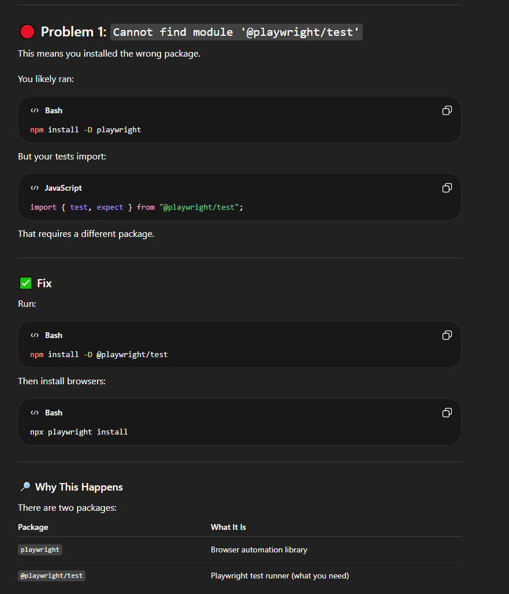
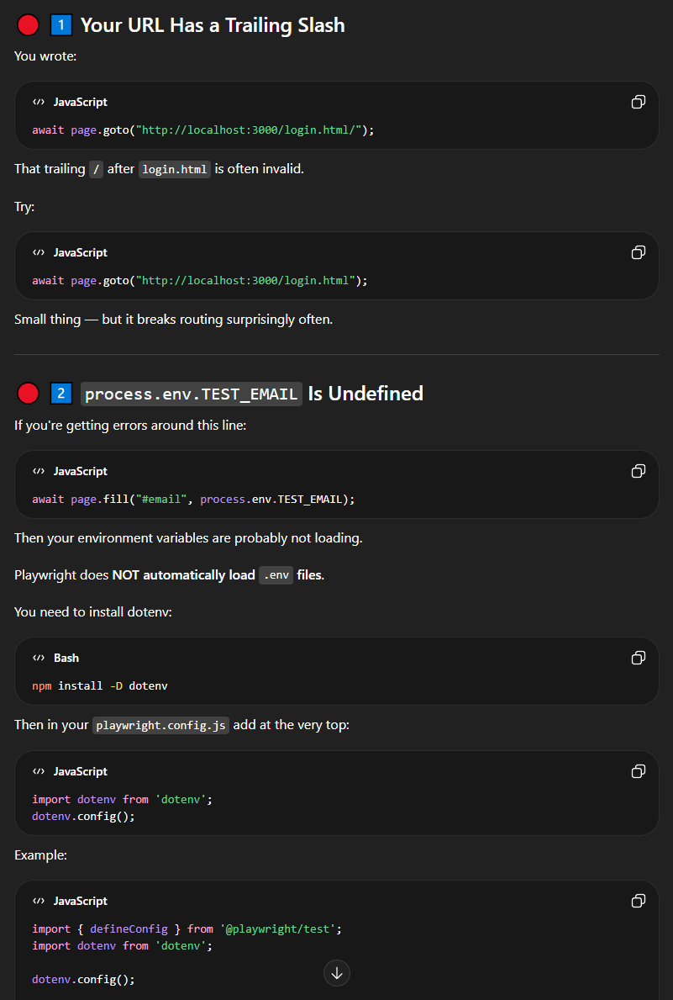

**Tool Used: chatGPT**

Date: 04.03.2026
Purpose: Explanation to why Playwright testing wasn't functioning accordingly.
Outcome: Playwright was installed, but not @Playwright/test which is crucial for this assignment. It helped me to better understand the differnce between the two and directed me to how to fix this. 

Date: 04.03.26
Purpose: Explanation to e2e test fail. Was not quite understanding why I kept receiving failed tests in login.spec.js after changes.
Outcome: It broke down the reasons behind the failed tests and how to fix this. Also, gave me direction on what to look into if my tests continued to fail.

